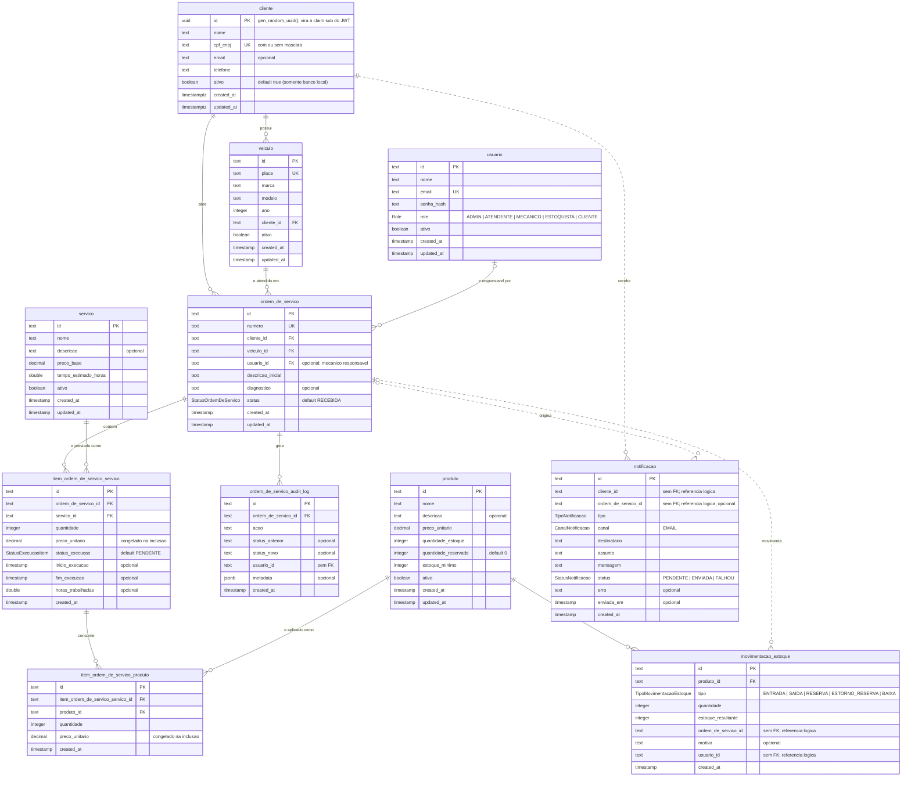

# Diagrama ER — Oficina Mecânica

Equivalente em Mermaid do [schema.dbml](schema.dbml) (importável no
[dbdiagram.io](https://dbdiagram.io)).

- **`cliente`** é a única tabela lida por esta Lambda; o schema abaixo segue
  `local/init.sql` deste repositório.
- As demais tabelas pertencem ao monolito da Fase 2
  (https://github.com/guilhermeqmaia/software-architecture-tech-challenge —
  `prisma/schema.prisma` e `prisma/migrations`, commit `8138156`) e estão aqui
  para mostrar como `cliente` se relaciona com o restante do domínio. A Lambda
  não escreve em nenhuma delas.
- Divergência local × produção da tabela `cliente` (tipo do `id`, precisão das
  datas e coluna `ativo`): ver [banco-de-dados.md](banco-de-dados.md), seção 1.

## Diagrama

Legenda: linha contínua = chave estrangeira física; linha tracejada =
referência lógica mantida pela aplicação (sem constraint no banco).

## Explicação dos relacionamentos

| Relacionamento                                                    | Cardinalidade                      | Regra de negócio / integridade                                                                                                                                                                                                                                                   |
| ----------------------------------------------------------------- | ---------------------------------- | -------------------------------------------------------------------------------------------------------------------------------------------------------------------------------------------------------------------------------------------------------------------------------- |
| `cliente` → `veiculo`                                             | 1 : N (cliente pode ter 0 ou mais) | Todo veículo tem exatamente um dono (`cliente_id NOT NULL`). `placa` é única no sistema. A exclusão do cliente é bloqueada se houver veículos (FK sem `ON DELETE CASCADE`; Prisma usa `RESTRICT`).                                                                               |
| `cliente` → `ordem_de_servico`                                    | 1 : N                              | Uma OS pertence a um único cliente, que aprova/rejeita o orçamento e acompanha o status (US-13, US-16). `ON DELETE CASCADE`: remover o cliente remove suas OS. É o `sub` do JWT emitido pela Lambda que identifica esse cliente nas rotas protegidas.                            |
| `veiculo` → `ordem_de_servico`                                    | 1 : N                              | Cada OS refere-se a um único veículo (`veiculo_id NOT NULL`). O veículo deve pertencer ao mesmo cliente da OS (regra validada no domínio, não no banco). `ON DELETE CASCADE`.                                                                                                    |
| `usuario` → `ordem_de_servico`                                    | 0..1 : N                           | `usuario_id` é o mecânico responsável; nulo enquanto a OS está `RECEBIDA`. Quando o mecânico se atribui, a OS vai para `EM_DIAGNOSTICO` (US-07). `ON DELETE SET NULL` preserva a OS se o usuário for removido.                                                                   |
| `ordem_de_servico` → `item_ordem_de_servico_servico`              | 1 : N                              | Serviços incluídos na OS pelo mecânico (US-09). `UNIQUE (ordem_de_servico_id, servico_id)`: um serviço aparece uma vez por OS (usa-se `quantidade`). `preco_unitario` é congelado no momento da inclusão para que o orçamento não mude se o catálogo mudar. `ON DELETE CASCADE`. |
| `servico` → `item_ordem_de_servico_servico`                       | 1 : N                              | Item referencia o serviço do catálogo; a exclusão do serviço é bloqueada se houver itens (`RESTRICT`), garantindo histórico.                                                                                                                                                     |
| `item_ordem_de_servico_servico` → `item_ordem_de_servico_produto` | 1 : N                              | Produtos/peças são vinculados **a um serviço da OS**, não à OS diretamente (US-10, migration `produto_vincula_a_servico`). `UNIQUE (item_servico_id, produto_id)`. `ON DELETE CASCADE`.                                                                                          |
| `produto` → `item_ordem_de_servico_produto`                       | 1 : N                              | Item referencia o produto do catálogo de estoque; exclusão bloqueada se houver itens (`RESTRICT`).                                                                                                                                                                               |
| `produto` → `movimentacao_estoque`                                | 1 : N                              | Cada movimento (ENTRADA, SAIDA, RESERVA, ESTORNO_RESERVA, BAIXA) pertence a um produto e grava `estoque_resultante` (US-18). `ON DELETE CASCADE`. Índice `(produto_id, created_at)` para o extrato.                                                                              |
| `ordem_de_servico` → `ordem_de_servico_audit_log`                 | 1 : N                              | Toda transição de status/ação relevante gera um registro imutável com `status_anterior`/`status_novo` e `metadata`. `usuario_id` não tem FK para preservar o histórico mesmo após exclusão do usuário. `ON DELETE CASCADE`.                                                      |
| `cliente` ⇢ `notificacao` (lógica)                                | 1 : N                              | Notificações (ORCAMENTO_PRONTO, OS_FINALIZADA, STATUS_OS_ALTERADO) são endereçadas a um cliente (US-20). Sem FK física: o contexto **Notificação** é desacoplado de **Atendimento**; a consistência é responsabilidade da aplicação. Índice em `cliente_id`.                     |
| `ordem_de_servico` ⇢ `notificacao` (lógica)                       | 0..1 : N                           | Opcional; aponta a OS que originou o aviso. Índice em `ordem_de_servico_id`.                                                                                                                                                                                                     |
| `ordem_de_servico` ⇢ `movimentacao_estoque` (lógica)              | 0..1 : N                           | Reservas ao adicionar produto à OS, baixa ao iniciar execução e estorno ao cancelar (policies do fluxo da OS). Sem FK para que o extrato de estoque sobreviva à remoção da OS. Índice em `ordem_de_servico_id`.                                                                  |

### Papel da Lambda neste modelo

A Lambda executa apenas
`SELECT id, nome, cpf_cnpj FROM cliente WHERE regexp_replace(cpf_cnpj, '[^0-9]', '', 'g') = $1 LIMIT 1`
e não participa de nenhum relacionamento acima. O `id` retornado vira a claim
`sub` do JWT, que o monolito usa para filtrar `ordem_de_servico.cliente_id` e
`notificacao.cliente_id` nas rotas do cliente. Recomendações de índice para esse
lookup em [banco-de-dados.md](banco-de-dados.md), seção 4.1.
